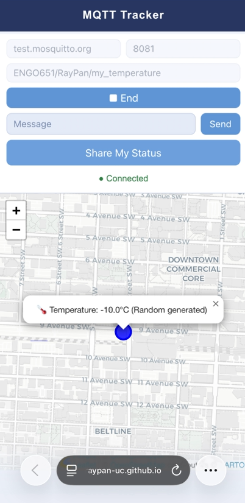

# MQTT Geolocation Tracker

A browser-based geolocation tracker that publishes and subscribes to real-time location and temperature data over MQTT using WebSocket. ([Access here](https://raypan-uc.github.io/mqtt-geolocation-tracker/))

## Features

- Connect to any MQTT broker via WebSocket (default: `test.mosquitto.org`)
- Publish custom messages to any MQTT topic
- Share current GPS location with a randomly generated temperature as a GeoJSON payload
- Receive and visualize location updates on an interactive Leaflet map
- Color-coded markers based on temperature:
  - **Blue** — below 10°C
  - **Green** — 10°C to 30°C
  - **Red** — above 30°C
- Auto-reconnects if the connection drops

## Tech Stack

| Library | Purpose |
|---|---|
| [Leaflet.js](https://leafletjs.com/) | Interactive map rendering |
| [Paho MQTT](https://www.eclipse.org/paho/) | WebSocket-based MQTT client |
| [CartoDB Positron](https://carto.com/basemaps/) | Map tile layer |

## Project Structure

```
mqtt-geolocation-tracker/
├── index.html        # Main UI and layout
├── css/
│   ├── style.scss    # Source styles
│   └── style.css     # Compiled styles
├── js/
│   ├── mqtt.js       # MQTT connection, publish, subscribe logic
│   └── geo.js        # Geolocation API and Leaflet map logic
└── assets/
    └── Screenshot.png
```

## How to Use

1. Open `index.html` in a browser (requires HTTPS or localhost for Geolocation API).
2. Enter the MQTT broker **Host** and **Port** (defaults to `test.mosquitto.org:8081`).
3. Click **Start** to connect to the broker.
4. Click **Share My Status** to publish your current GPS location and a random temperature to the topic `ENGO651/RayPan/my_temperature`.
5. Any messages received on the subscribed topic will appear as a marker on the map.
6. Click **End** to disconnect.

## MQTT Message Format

Messages are published as GeoJSON `Feature` objects. The temperature is randomly generated between -40°C and 60°C:

```json
{
  "type": "Feature",
  "geometry": {
    "type": "Point",
    "coordinates": [-114.0719, 51.0447]
  },
  "properties": {
    "temperature": 23.5
  }
}
```

## Screenshot



## Demo Video
  Demo Video: https://youtu.be/frtYwRVlDlw

